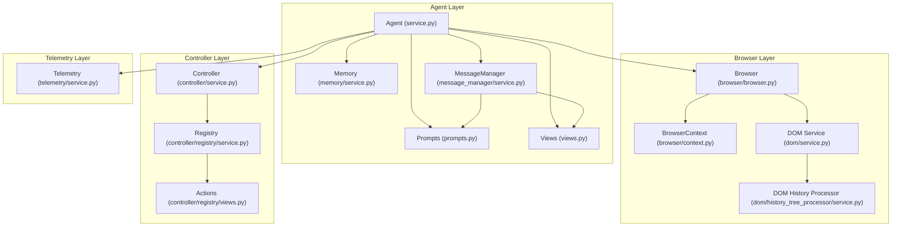

# Codebase Structure

> The code structure inspired by https://github.com/Netflix/dispatch.

Very good structure on how to make a scalable codebase is also in [this repo](https://github.com/zhanymkanov/fastapi-best-practices).

Just a brief document about how we should structure our backend codebase.

## Code Structure

```markdown
src/
/<service name>/
models.py
services.py
prompts.py
views.py
utils.py
routers.py

    	/_<subservice name>/
```

### Service.py

Always a single file, except if it becomes too long - more than ~500 lines, split it into \_subservices

### Views.py

Always split the views into two parts

```python
# All
...

# Requests
...

# Responses
...
```

If too long → split into multiple files

### Prompts.py

Single file; if too long → split into multiple files (one prompt per file or so)

### Routers.py

Never split into more than one file


### Architecture diagram




